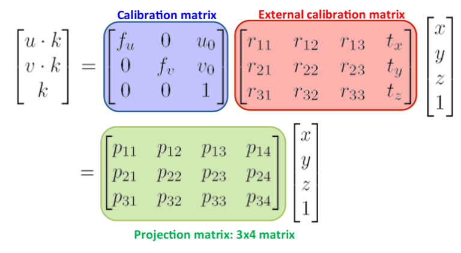
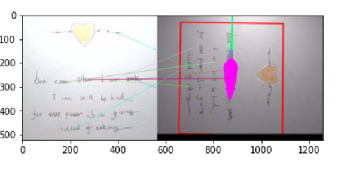
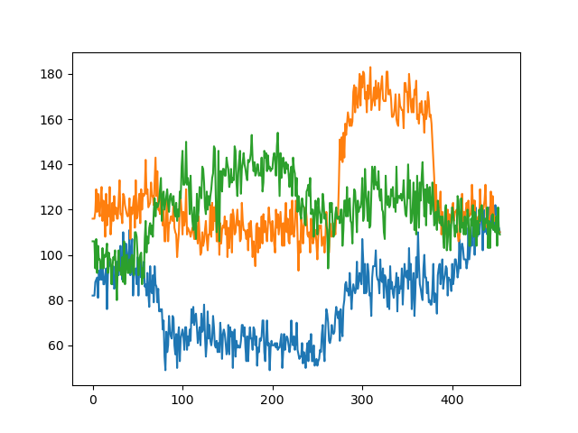
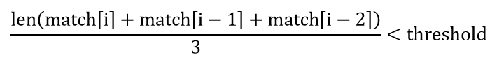

# AR项目：基于Python的移动设备上多目标3D成像

成员及分工
- 高欣奔 PB18000176
  - 设计，编程
- 蔡毓灵 PB18000001
  - 设计，文档编写


## 问题描述

- 受AR艺术展影响，我们想要在移动设备上做出针对多个目标的对应的3D模型成像，这对于AR技术的生活化有重要的现实意义。
- 我们做了一个Demo演示视频(./result10.mp4)，使用了三幅日常图片(.jpg)和三个动物三维模型(.obj)，在手机成像中实现了良好的效果。
- 要具体实现这样的功能，我们可以利用单目标的AR成像的原理，通过对源帧和目标帧的关键点提取和匹配计算投影矩阵，
并将3D模型投影到当前帧上。而在多目标时，可能会遇到背景点干扰、非目标帧干扰等问题，我们对匹配过程设计了一个平滑算法，
并进行了背景匹配消除等优化措施，最终实现了多目标成像的平滑和鲁棒性。

## 原理分析
### 总体思路
- 项目的主要步骤
  - 识别参考平面。
  - 估计单应性。
  - 从单应性推导出从参考表面坐标系到目标图像坐标系的变换。
  - 在图像（像素空间）中投影我们的 3D 模型并绘制它。

### 识别参考平面
- 对于一张平面参考图像，我们希望能够快速有效地判断现实图像和它是否匹配，因此可以采用ORB算法，它能够高效地获取当前图像与参考图像的关键点的空间信息，例如坐标点、方向等等，采取合适的度量方式，如汉明距离，从而得到图片匹配程度度量

### 单应性估计与投影矩阵
- 单应性矩阵是指对同一平面的仿射变换，例如在三维空间中的单应性矩阵为3×3大小，它可以实现三维空间中的点对仿射变换
- 单应性矩阵homography的估计基于ORB算法得到的关键点。在进行目标图像和当前帧图像的关键点匹配之后，即可估计出仿射变换矩阵，利用这个矩阵来实现投影
- 投影矩阵是将三维立体模型投影到空间中，因而需要考虑相机参数，例如焦距，以及三维空间中点的仿射变换，利用这些信息可以估计出投影矩阵
- 
### 3D模型投影和绘制
- 本项目中的3D模型由obj文件给出，它包含了3D模型的空间点坐标、面的空间点索引、颜色等信息
- 利用所得到的投影矩阵，我们可以对obj的点进行投影变换成像


## 代码实现
### 文件准备：model、obj文件、mp4视频文件
* model文件即目标图像，为三维彩色图像；
* obj文件为3D模型图像，里面包含了空间点坐标，面坐标索引，颜色信息(使用软件MeshLab上色导出)；
* 最终分别存成model_list，obj_list；
* mp4视频文件为手机摄影文件；
```python
    model1 = cv2.imread('D:/Program/augmented-reality-master/src/models/model1.jpg', flags=3)
    obj1 = OBJ('D:/Program/augmented-reality-master/src/models/fox_color.obj', swapyz=True)
    model_list=[model1,model2,model3]
    obj_list=[obj1,obj2,obj3]
    cap = cv2.VideoCapture('D:/Program/augmented-reality-master/src/models/video.MP4')
```

### ORB算法实现关键点检测
* 我们调用CV库中的ORB算法，实现源帧和目的帧的关键点检测
- 定义匹配器(通过计算两幅图像关键点之间的汉明距离判断是否匹配)
```python   
    bf = cv2.BFMatcher(cv2.NORM_HAMMING, crossCheck=True)
```
- ORB算法的选取关键点及描述符(包含坐标、方向等信息)
- 关键点用于后续寻找投影矩阵，描述符则用来寻找匹配点
```python
    kp_model, des_model = orb.detectAndCompute(model_list[sam], None)
    kp_frame, des_frame = orb.detectAndCompute(frame, None)
```
- 匹配操作,返回match数组，也即匹配点对的集合
```python    
    match=bf.match(des_model, des_frame)
```

- 下图的标注展示了keypoint的匹配过程：
- 

### 多目标情形匹配算法
- 上节简要展示了匹配点对如何计算，在多目标情形时，由于我们想实现现实图片与3D模型一对一的映射，因此需要计算当前帧与三个目标图像之间的match数组，并且找出最为匹配的一项
- 我们在实际实验中发现了一些问题，我们的原始思路：  
  - 首先计算三个match得到match_list数组: match_list=[match1,match2,match3]
  - 通过判断len(match),寻找最匹配的点
- len(match)随帧增加的变化：
- 


- 可见，由于model自身与环境背景的匹配属性差异，三条折线的起始点并不一致，这使得len(match)并不能很好地衡量当前图像帧和目标图像的匹配程度.
- 以len(match0)表示视频第一帧与model的匹配点对个数，我们考虑将len(match)-len(match0)作为当前帧与该model的匹配程度度量
- 实验结果表明，我们的做法能够使AR算法对于环境变化有良好的鲁棒性。

### 时间尺度平滑
- 由上节len(match)的可视化图像可见，两个帧匹配点对数波动较大，因此我们设计了时间尺度的平滑操作
- 设定阈值threshold，当前匹配程度取决于当前帧len(match[i])与前两帧len(match[i-1])、len(match[i-2])
- 判断：
- 
- 若为真则对当前帧进行三维成像
### 投影矩阵计算
- 首先将之前得到的关键点的坐标
```python
    src_pts = np.float32([kp_model[idx][m.queryIdx].pt for m in match_list[idx]]).reshape(-1, 1, 2)
    dst_pts = np.float32([kp_frame[m.trainIdx].pt for m in match_list[idx]]).reshape(-1, 1, 2)
```
- 然后对坐标使用CV库函数findHomography计算单应性变换矩阵homography(3×3)，表示三维空间的点映射关系
```python
    homography, mask = cv2.findHomography(src_pts, dst_pts, cv2.RANSAC, 5.0)
```
- 最后结合相机参数矩阵计算投影矩阵：
```python
    projection = projection_matrix(camera_parameters, homography) 
```
### obj文件投影与绘制
- 准备完投影矩阵后，我们调用render函数进行三维模型映射
```python
    frame = render(frame, obj, projection, model, True)
```

## 效果展示
- 

## 工程结构

```text
.
├── code
│   └── ar_main.py
├── models
│   ├── cat_color.obj
│   ├── rat_color.obj
│   ├── fox_color.obj
│   ├── model1.jpg
│   ├── model2.jpg
│   └── model3.jpg
└── output
    └── result.mp4
```

## 运行说明


```
numpy==1.19.5
opencv-python==4.5.1
matplotlib==3.4.1
```

```
pip install opencv-python
pip install numpy
pip install matplotlib
pip install os
python ar_main.py
```

